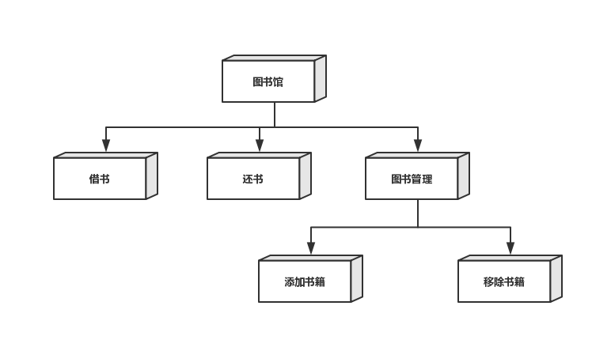
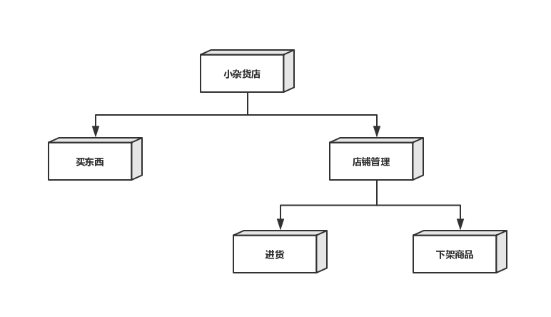
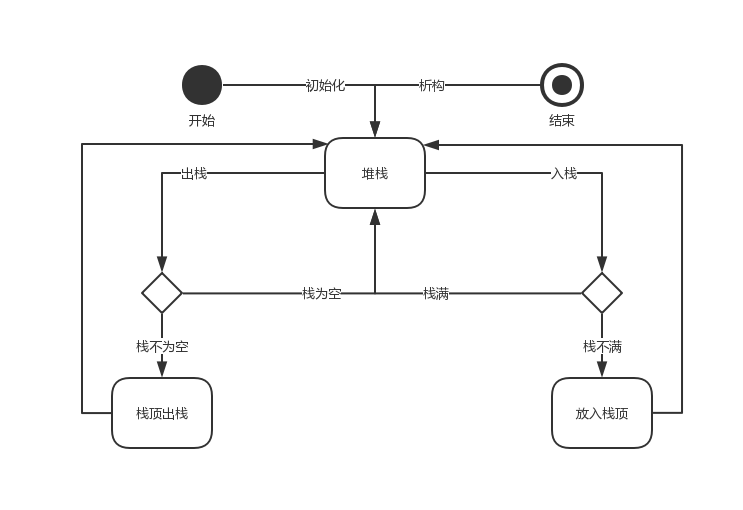
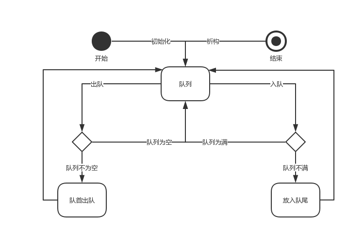
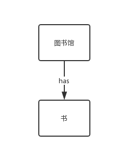
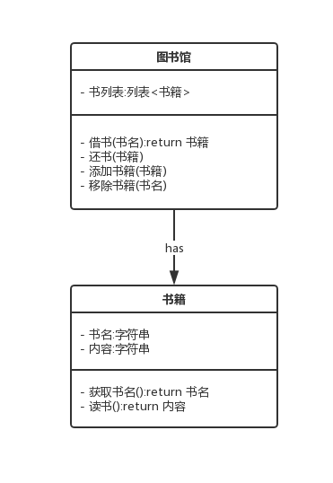
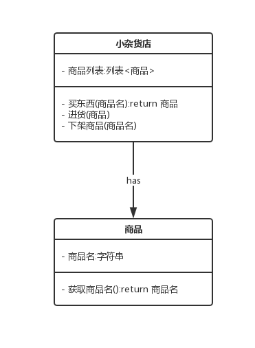

# 第十章练习题

## 第1题

使得软件的可维护性更强，进而延长了软件的生命周期

## 第2题

传值。

模块间传值的耦合为**数据耦合**，传引用则为**标记耦合**。数据耦合比标记耦合传递更少的信息，故其耦合性更低。

## 第3题

传引用。

## 第4题


## 第5题


## 第6题


## 第7题


## 第8题


## 第9题


## 第10题



## 第11题



## 第12题



## 第13题



## 第14题



## 第15题


## 第16题



## 第17题



## 第18题

```text
(1999-1000+1)^3=10^9
```

## 第19题

```text
1000,1000,1000
1000,1000,1999
1000,1999,1000
1000,1999,1999
1999,1000,1000
1999,1000,1999
1999,1999,1000
1999,1999,1999
```

## 第20题

```text
假设这个随机数生成器为rand()，那么生成测试例的方法为：
rand()*1000+1000,rand()*1000+1000,rand()*1000+1000
```

